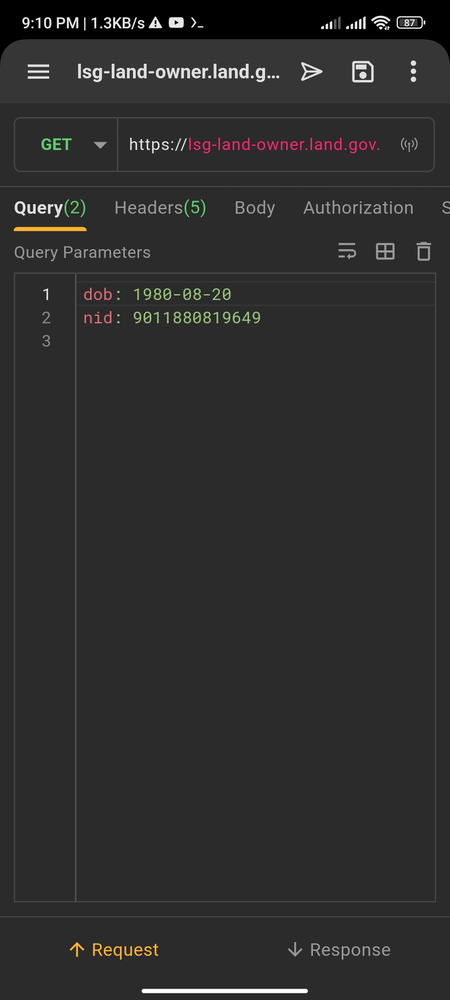
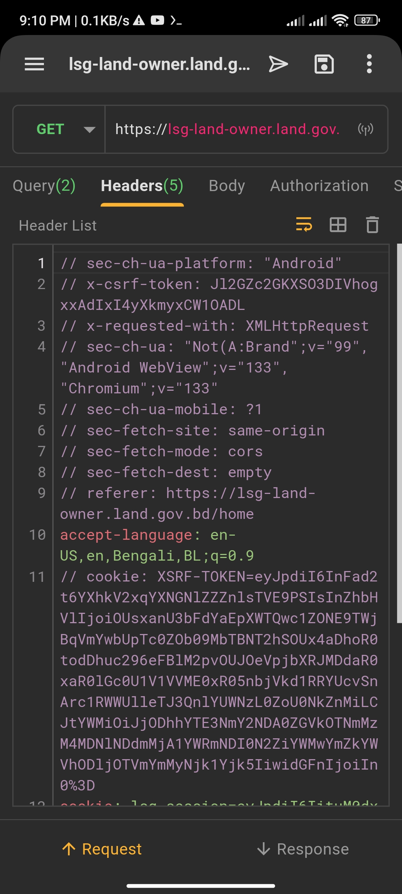

# Nogod-block

''' python nogod.py '''


# api :-

``` https://lsg-land-owner.land.gov.bd/nidverify?dob=1980-08-20&nid=9011880819649 ```

## p1

dob: 1980-08-20
nid: 9011880819649


<!--[profile](./p1.jpg)-->



## p2

// sec-ch-ua-platform: "Android"
// x-csrf-token: Jl2GZc2GKXSO3DIVhogxxAdIxI4yXkmyxCW1OADL
// x-requested-with: XMLHttpRequest
// sec-ch-ua: "Not(A:Brand";v="99", "Android WebView";v="133", "Chromium";v="133"
// sec-ch-ua-mobile: ?1
// sec-fetch-site: same-origin
// sec-fetch-mode: cors
// sec-fetch-dest: empty
// referer: https://lsg-land-owner.land.gov.bd/home
accept-language: en-US,en,Bengali,BL;q=0.9
// cookie: XSRF-TOKEN=eyJpdiI6InFad2t6YXhkV2xqYXNGNlZZZnlsTVE9PSIsInZhbHVlIjoiOUsxanU3bFdYaEpXWTQwc1ZONE9TWjBqVmYwbUpTc0ZOb09MbTBNT2hSOUx4aDhoR0todDhuc296eFBlM2pvOUJOeVpjbXRJMDdaR0xaR0lGc0U1V1VVME0xR05nbjVkd1RRYUcvSnArc1RWWUlleTJ3QnlYUWNzL0ZoU0NkZnMiLCJtYWMiOiJjODhhYTE3NmY2NDA0ZGVkOTNmMzM4MDNlNDdmMjA1YWRmNDI0N2ZiYWMwYmZkYWVhODljOTVmYmMyNjk1Yjk5IiwidGFnIjoiIn0%3D
cookie: lsg_session=eyJpdiI6IituM0dxaGRTbFVXQi9GaGlNa04wM0E9PSIsInZhbHVlIjoiakJCOE44NjhNa2JOalVialgrM2ZWdkNOeUlJUUhRUTYreWJleU51V3k5cTNhNkJMVnRUaS9tUVk5UldPeTBFd0dCeVV4L0pYazZtSW5EVUUyamljK21yeWFLOWhCS3hGRkFydjRkMEo3WUxHeUJVRUVjTGl3R1l1cVJJUFlIMkoiLCJtYWMiOiIxNTM3ZmJkZjFjNjdhNzFmYzYxNmIzYzkxZTA4OGRmOTMzNTc4NDA1MzA4NDlmN2VmNWJkNDFiZDMzYzE2Mzg0IiwidGFnIjoiIn0%3D
// priority: u=1, i


<!--[profile](./p2.jpg)-->



